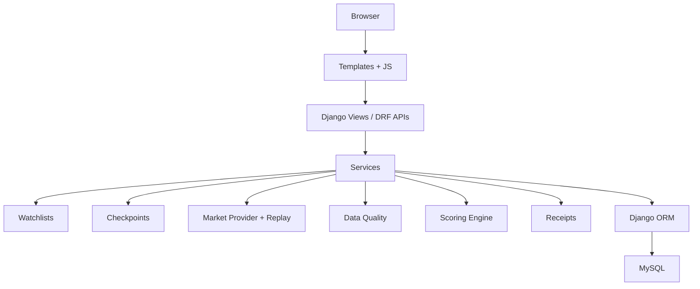

# Gapline

Checkpoint-based market change review for a deterministic stock watchlist demo.

## Product Pitch

Normal watchlists mainly show prices and percent changes. Gapline asks a sharper question: what changed unusually since the user last explicitly understood the watchlist? The user clicks "Mark understood" to create a server-side checkpoint. Later, deterministic replay advances market time and Gapline compares each stock with that baseline, normalizes movement against recent volatility, checks benchmark divergence, detects reversals, and suppresses stale or conflicting data before ranking. Every result has a transparent Change Receipt, so the demo explains why an item is routine, needs attention, or needs verification.

## Problem Interpretation

Raw percent changes lack context. Market-wide movement can create false urgency. Final prices can hide reversals. Bad data can create false confidence. Most importantly, last-viewed does not equal understood. Gapline separates viewing from understanding.

## Core Product Loop

Add stock -> Mark understood -> checkpoint -> advance replay -> return -> classification -> change receipt -> mark understood again.

## Tech Stack

Python, Django, Django REST Framework, MySQL, Django Templates, HTML, CSS, and vanilla JavaScript.

## Architecture



## Project Structure

`watchlists` owns watchlists and items. `checkpoints` owns append-only baselines. `market` owns observations, bars, incidents, replay, providers, and seed commands. `scoring` contains pure calculation functions. `receipts` stores immutable calculation snapshots. `dashboard` renders the summary workflow. `demo` owns staff-only replay controls.

## Database Model

Main models are `Watchlist`, `WatchlistItem`, `ItemCheckpoint`, `MarketObservation`, `MarketBar`, `SymbolStatistic`, `ChangeReceipt`, `DataIncident`, and `ReplayState`. Market data is shared by symbol/provider. User-specific state is watchlist membership, checkpoints, and receipts.

## Checkpoint Semantics

Only pressing "Mark understood" creates a checkpoint. Dashboard visits, watchlist visits, receipt visits, login, logout, refresh, and replay advancement never checkpoint.

## Meaningful Change Engine

Daily returns are `price_t / price_(t-1) - 1`. Twenty daily returns come from 21 closes. Gap volatility is `daily_volatility * sqrt(days_since_checkpoint)`.

Own surprise ratio is `stock_return / expected_gap_volatility`, capped at 3.0 and worth up to 45 points. Benchmark residual is `stock_return - benchmark_return`; residual ratio is `residual_return / expected_residual_gap_volatility`, capped at 3.0 and worth up to 55 points. Final attention score is `round(own_component + benchmark_component)`. Scores at or above 60 are Needs Attention.

Reversal is flagged when max excursion is at least 2x expected gap volatility and the final return is within 35% of that excursion. Reversal does not add score; it changes classification when relevant.

## Data Quality Model

`as_of` is when the market value was true. `received_at` is when Gapline received it. Gapline gates scoring before ranking for delayed, conflicting, missing interval, malformed, corporate action, and out-of-order conditions. Verify Data items are not ranked as normal urgent items.

## Deterministic Demo Replay

The demo uses fixed seed `41729`, fixed replay start `2026-08-03 15:30 Asia/Kolkata`, and correlated synthetic market, sector, and stock factors. Resetting the demo regenerates identical history and future replay values.

## Persistence and Idempotency

Watchlists, checkpoints, and receipts live server-side in MySQL. Duplicate stock addition is handled with `UniqueConstraint(watchlist, symbol)`, `transaction.atomic()`, and `get_or_create()`.

## Authentication

Gapline uses Django session authentication and HTTP-only session cookies. APIs use `request.user`; the frontend never supplies trusted user IDs.

## Scaling Approach

Future production evolution could add background market ingestion, caching if justified, horizontal API servers, database scaling, monitoring, and real provider adapters. These are intentionally not implemented in this prototype.

## Architecture Trade-offs

The modular monolith keeps the core loop easy to verify. MySQL satisfies the required relational store. Django sessions fit browser-first authentication. Redis, Kafka, microservices, WebSockets, and Kubernetes are excluded because they do not improve this deterministic request/response demo.

## Intentionally Excluded

AI, predictions, sentiment, news, generic alerts, buy/sell advice, Redis, Kafka, microservices, WebSockets, and Kubernetes.

## Setup

1. Install Python and MySQL.
2. Create the database:

```sql
CREATE DATABASE gapline CHARACTER SET utf8mb4 COLLATE utf8mb4_unicode_ci;
```

3. Create and activate a virtual environment:

```powershell
python -m venv venv
venv\Scripts\activate
```

macOS/Linux:

```bash
python -m venv venv
source venv/bin/activate
```

4. Install dependencies:

```bash
pip install -r requirements.txt
```

5. Copy `.env.example` to `.env` and configure database credentials.
6. Run:

```bash
python manage.py migrate
python manage.py seed_demo
python manage.py runserver
```

## Demo Accounts

`demo` / `gapline-demo` with email `demo@gapline.local`.

`second` / `gapline-second` with email `second@gapline.local`.

## Demo Flow

Login, open Watchlist, mark stocks understood, advance replay, return Dashboard, inspect TCS Routine, INFY Needs Attention, TATAMOTORS Reversal after more replay, HDFCBANK Verify Data, RELIANCE provider conflict, then use the dashboard cards to mark items understood again.

## Railway Setup

1. Push this repository to GitHub.
2. Create a Railway project from the GitHub repository.
3. Add a Railway MySQL service.
4. On the Django service configure:

```text
DB_NAME=${{MySQL.MYSQLDATABASE}}
DB_USER=${{MySQL.MYSQLUSER}}
DB_PASSWORD=${{MySQL.MYSQLPASSWORD}}
DB_HOST=${{MySQL.MYSQLHOST}}
DB_PORT=${{MySQL.MYSQLPORT}}
DEBUG=False
SECRET_KEY=<secure-random-secret>
```

Railway provides `RAILWAY_PUBLIC_DOMAIN`; the app automatically adds it to `ALLOWED_HOSTS` and trusted CSRF origins.

Build/static step:

```bash
python manage.py collectstatic --noinput
```

Pre-deploy command:

```bash
python manage.py migrate
```

Start command:

```bash
gunicorn gapline.wsgi:application --bind 0.0.0.0:$PORT --workers 2 --timeout 60
```

In Railway, open Service -> Settings -> Networking -> Generate Domain. The generated `https://....up.railway.app` address is the hackathon demo link.

After the first successful deployment, run the demo seed once:

```bash
npm i -g @railway/cli
railway login
railway link
railway ssh -- python manage.py seed_demo
```

Do not put `seed_demo` in the normal pre-deploy command; every deploy would reset judge activity.

## Tests

```bash
python manage.py test
```

## Reset Demo

```bash
python manage.py reset_demo
```

## Known Limitations

The market is deterministic synthetic fixture data. There is no live ingestion, no background job runner, no charting package, no investment advice, and no production observability stack. A running local MySQL server is required for normal migration and test execution with the default settings.
